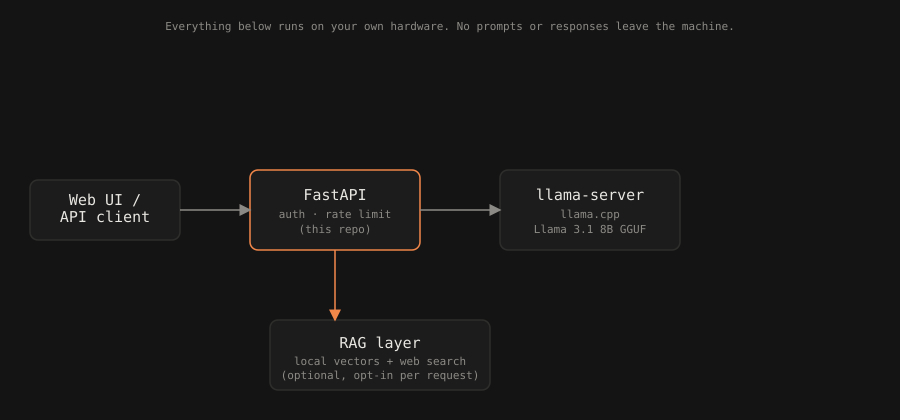

# Architecture

<p align="center">
  
</p>

## Components

1. **llama-server** (llama.cpp) — runs Llama 3.1 8B Instruct (GGUF, quantized),
   exposes an internal OpenAI-compatible endpoint. Not exposed publicly;
   only reachable from the `api` service over the Docker network.
2. **api** (FastAPI) — public-facing service. Proxies chat requests to
   `llama-server`, adds optional API key auth, rate limiting, request
   logging, and the RAG retrieval step when enabled.
3. **web UI** — minimal chat interface served by the `api` service,
   talking to the same `/v1/*` endpoints any external client would use.
4. **RAG layer** — optional retrieval step: local vector store for your own
   documents, plus an optional web-search tool call for live results. Both
   feed additional context into the prompt before it reaches `llama-server`.
   No external LLM API is ever called — only a search API, if enabled.

## Data flow

```
client → api (auth, rate limit) → [optional RAG retrieval] → llama-server → response → client
```

## Deployment

Designed to run via `docker compose up` for local/single-host use. See
`docs/deployment.md` (added with `feat/llama-server-docker`) for GPU vs
CPU notes and resource sizing guidance.
